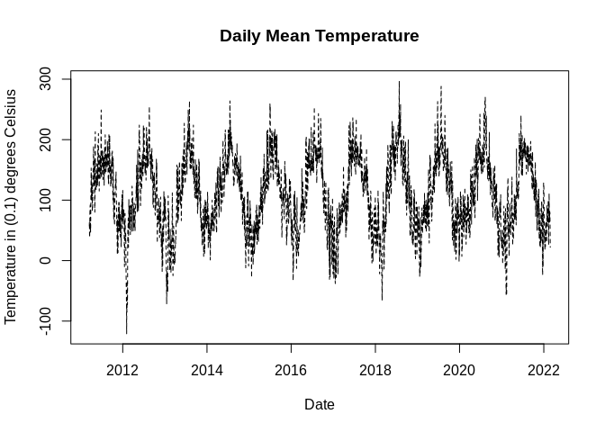
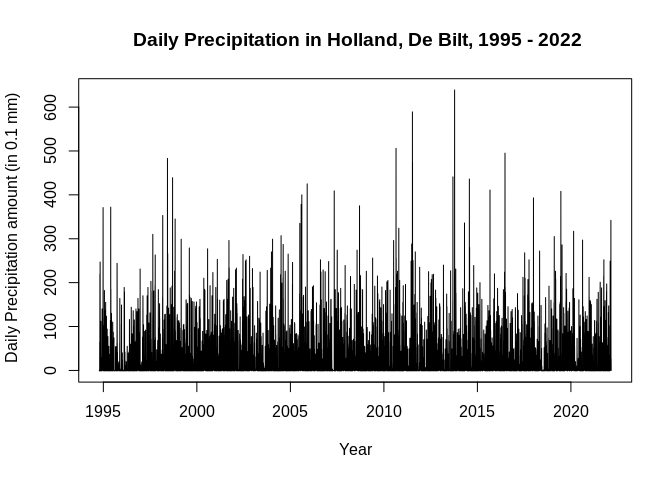
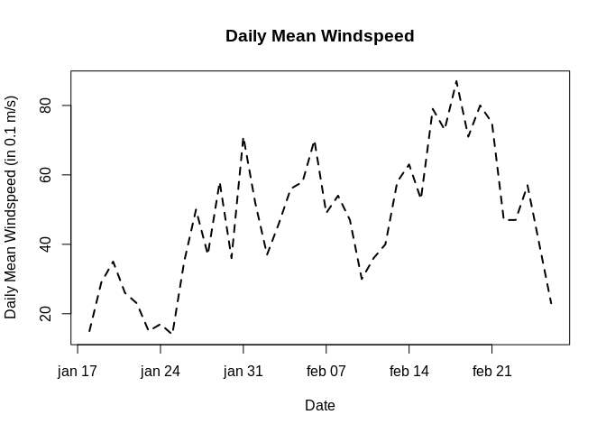

<!-- README.md is generated from README.Rmd. Please edit that file -->

# DutchWeather: a package for importing KNMI weather data

[](https://github.com/Glender/DutchWeather)
[](https://www.codefactor.io/repository/github/rossellhayes/ipa)
[](https://lifecycle.r-lib.org/articles/stages.html#maturing)
[](https://github.com/rossellhayes/ipa/actions)
[](https://codecov.io/gh/rcannood/princurve)
[](https://github.com/Glender/DutchWeather)

The goal of DutchWeather package is to provide easy to use functions to
download weather statistics from the KNMI website.

## :arrow\_double\_down: Installation

Assuming the devtools package is installed correctly, you can install
the development version of DutchWeather with:

``` r
# install.packages("devtools")
devtools::install_github("Glender/DutchWeather", ref="master")
```

## :sunny: :umbrella: :cloud: Some examples

Suppose you want to download some daily weather statistics for research
purposes. You can, for example, plot the results of the daily mean
temperature:

``` r
library(DutchWeather)
## get daily weather data from the KNMI website
data <- get_daily_zipdata(station_id = 260)

# show bottem rows
tail(data)
#> # A tibble: 6 x 41
#>   `# STN` YYYYMMDD   DDVEC FHVEC    FG   FHX  FHXH   FHN  FHNH   FXX  FXXH    TG
#>     <int> <date>     <int> <int> <int> <int> <int> <int> <int> <int> <int> <int>
#> 1     260 2022-02-21   275    67    75   100    13    40    22   200     9    65
#> 2     260 2022-02-22   246    41    47    70    13    30     2   140    17    71
#> 3     260 2022-02-23   221    44    47    70    13    20     8   140    15    80
#> 4     260 2022-02-24   226    47    57    90    12    30    20   170    12    62
#> 5     260 2022-02-25   266    35    40    60     5    10    21   140    11    47
#> 6     260 2022-02-26   133    19    23    40    14    10     1    70    14    22
#> # … with 29 more variables: TN <int>, TNH <int>, TX <int>, TXH <int>,
#> #   T10N <int>, T10NH <int>, SQ <int>, SP <int>, Q <int>, DR <int>, RH <int>,
#> #   RHX <int>, RHXH <int>, PG <int>, PX <int>, PXH <int>, PN <int>, PNH <int>,
#> #   VVN <int>, VVNH <int>, VVX <int>, VVXH <int>, NG <int>, UG <int>, UX <int>,
#> #   UXH <int>, UN <int>, UNH <int>, EV24 <int>


# and plot some results
df <- tail(data, 4000)

plot(
  df$YYYYMMDD, df$TG, 
   type = "l", lty=2, 
   xlab = "Date",  ylab = "Temperature in (0.1) degrees Celsius",
   main = "Daily Mean Temperature"
)
```



Similarly, we can plot the daily precipitation for the last 30 years:

``` r

# get data of the last 10.000 days
df <- tail(data, 10000)

plot(
  df$YYYYMMDD, df$RH,
  type = "l",
  main = " Daily Precipitation in Holland, De Bilt, 1995 - 2022",
  xlab = "Year",
  ylab = " Daily Precipitation amount (in 0.1 mm)",
)
```



Or you can plot the daily mean windspeed for the last 40 days:

``` r

# get data of the last 40 days
df <- tail(data, 40)

plot(
  df$YYYYMMDD, df$FG, 
   type = "l", lty=2, 
   xlab = "Date",  ylab = "Daily Mean Windspeed (in 0.1 m/s)",
   main = "Daily Mean Windspeed",
   lwd = 2
)
```



Because the packages contains 41 variables, a lot of analyses are
possible, see a description of the variables down below.

## Description of Variables:

YYYYMMDD = Datum (YYYY=jaar MM=maand DD=dag) / Date (YYYY=year MM=month
DD=day)  
DDVEC = Vectorgemiddelde windrichting in graden (360=noord, 90=oost,
180=zuid, 270=west, 0=windstil/variabel).  
FHVEC = Vectorgemiddelde windsnelheid (in 0.1 m/s).  
FG = Etmaalgemiddelde windsnelheid (in 0.1 m/s) / Daily mean windspeed
(in 0.1 m/s)  
FHX = Hoogste uurgemiddelde windsnelheid (in 0.1 m/s) / Maximum hourly
mean windspeed (in 0.1 m/s)  
FHXH = Uurvak waarin FHX is gemeten / Hourly division in which FHX was
measured  
FHN = Laagste uurgemiddelde windsnelheid (in 0.1 m/s) / Minimum hourly
mean windspeed (in 0.1 m/s)  
FHNH = Uurvak waarin FHN is gemeten / Hourly division in which FHN was
measured  
FXX = Hoogste windstoot (in 0.1 m/s) / Maximum wind gust (in 0.1 m/s)  
FXXH = Uurvak waarin FXX is gemeten / Hourly division in which FXX was
measured  
TG = Etmaalgemiddelde temperatuur (in 0.1 graden Celsius) / Daily mean
temperature in (0.1 degrees Celsius)  
TN = Minimum temperatuur (in 0.1 graden Celsius) / Minimum temperature
(in 0.1 degrees Celsius)  
TNH = Uurvak waarin TN is gemeten / Hourly division in which TN was
measured  
TX = Maximum temperatuur (in 0.1 graden Celsius) / Maximum temperature
(in 0.1 degrees Celsius)  
TXH = Uurvak waarin TX is gemeten / Hourly division in which TX was
measured  
T10N = Minimum temperatuur op 10 cm hoogte (in 0.1 graden Celsius) /
Minimum temperature at 10 cm above surface (in 0.1 degrees Celsius)  
T10NH = 6-uurs tijdvak waarin T10N is gemeten / 6-hourly division in
which T10N was measured; 6=0-6 UT, 12=6-12 UT, 18=12-18 UT, 24=18-24
UT  
SQ = Zonneschijnduur (in 0.1 uur) berekend uit de globale straling (-1
voor \<0.05 uur) / Sunshine duration (in 0.1 hour) calculated from
global radiation (-1 for \<0.05 hour)  
SP = Percentage van de langst mogelijke zonneschijnduur / Percentage of
maximum potential sunshine duration  
Q = Globale straling (in J/cm2) / Global radiation (in J/cm2)  
DR = Duur van de neerslag (in 0.1 uur) / Precipitation duration (in 0.1
hour)  
RH = Etmaalsom van de neerslag (in 0.1 mm) (-1 voor \<0.05 mm) / Daily
precipitation amount (in 0.1 mm) (-1 for \<0.05 mm)  
RHX = Hoogste uursom van de neerslag (in 0.1 mm) (-1 voor \<0.05 mm) /
Maximum hourly precipitation amount (in 0.1 mm) (-1 for \<0.05 mm)  
RHXH = Uurvak waarin RHX is gemeten / Hourly division in which RHX was
measured  
PG = Etmaalgemiddelde luchtdruk herleid tot zeeniveau (in 0.1 hPa)
berekend uit 24 uurwaarden / Daily mean sea level pressure (in 0.1 hPa)
calculated from 24 hourly values  
PX = Hoogste uurwaarde van de luchtdruk herleid tot zeeniveau (in 0.1
hPa) / Maximum hourly sea level pressure (in 0.1 hPa)  
PXH = Uurvak waarin PX is gemeten / Hourly division in which PX was
measured  
PN = Laagste uurwaarde van de luchtdruk herleid tot zeeniveau (in 0.1
hPa) / Minimum hourly sea level pressure (in 0.1 hPa)  
PNH = Uurvak waarin PN is gemeten / Hourly division in which PN was
measured  
VVN = Minimum opgetreden zicht / Minimum visibility; 0: \<100 m,
1:100-200 m, 2:200-300 m,…, 49:4900-5000 m, 50:5-6 km, 56:6-7 km, 57:7-8
km,…, 79:29-30 km, 80:30-35 km, 81:35-40 km,…, 89: \>70 km)  
VVNH = Uurvak waarin VVN is gemeten / Hourly division in which VVN was
measured  
VVX = Maximum opgetreden zicht / Maximum visibility; 0: \<100 m,
1:100-200 m, 2:200-300 m,…, 49:4900-5000 m, 50:5-6 km, 56:6-7 km, 57:7-8
km,…, 79:29-30 km, 80:30-35 km, 81:35-40 km,…, 89: \>70 km)  
VVXH = Uurvak waarin VVX is gemeten / Hourly division in which VVX was
measured  
NG = Etmaalgemiddelde bewolking (bedekkingsgraad van de bovenlucht in
achtsten, 9=bovenlucht onzichtbaar) / Mean daily cloud cover (in
octants, 9=sky invisible)  
UG = Etmaalgemiddelde relatieve vochtigheid (in procenten) / Daily mean
relative atmospheric humidity (in percents)  
UX = Maximale relatieve vochtigheid (in procenten) / Maximum relative
atmospheric humidity (in percents)  
UXH = Uurvak waarin UX is gemeten / Hourly division in which UX was
measured  
UN = Minimale relatieve vochtigheid (in procenten) / Minimum relative
atmospheric humidity (in percents)  
UNH = Uurvak waarin UN is gemeten / Hourly division in which UN was
measured  
EV24 = Referentiegewasverdamping (Makkink) (in 0.1 mm) / Potential
evapotranspiration (Makkink) (in 0.1 mm)  

## :speech\_balloon: Help

The documentation of all functions can be accessed by `?<function-name>`
or navigate via the package documentation help page `?DutchWeather`.

    # For example:
    ?get_daily_zipdata
